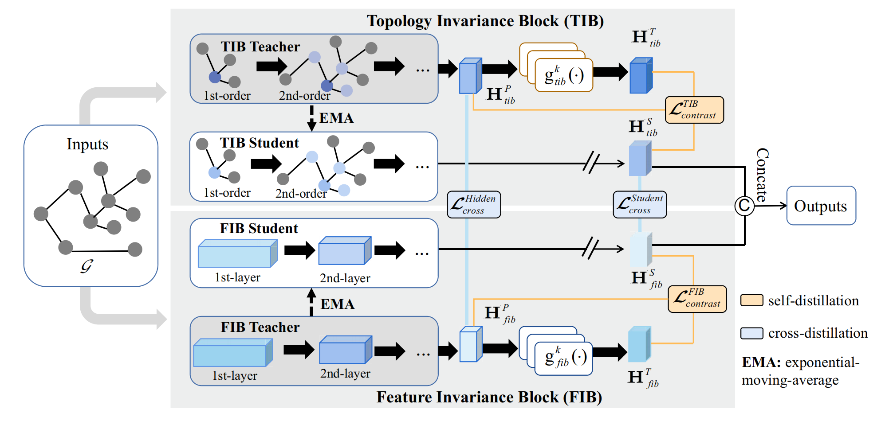

#SSD: Self-supervised Distillation for Heterophilic Graph Representation Learning

## Framework

## run diistillation methds
cd Distillation\ GNNtoMLP  you can run the poular baselines such as  LinkDist, GraphMLP, AdaGMLP, etc   

## DCGRL

cd examples\

python main.py

## Data augmentation

-[COLES]  Contrastive laplacian eigenmaps in *NeurIPS*, 2021. [\[paper\]](https://proceedings.neurips.cc/paper/2021/hash/2d1b2a5ff364606ff041650887723470-Abstract.html)  [\[code\]](https://github.com/allenhaozhu/COLES)

-[HomoGCL]  HomoGCL: Rethinking Homophily in Graph Contrastive Learning in *KDD*, 2024. [\[paper\]](https://arxiv.org/abs/2306.09614)  [\[code\]](https://github.com/wenzhilics/HomoGCL)

-[GRACE] Deep Graph Contrastive Representation Learning  in *ICLR*, 2020. [\[paper\]](https://arxiv.org/abs/2006.04131)  [\[code\]](https://github.com/CRIPAC-DIG/GRACE)

-[GraphCL] Graph Contrastive Learning with Augmentations  in *NeurIPS*, 2020. [\[paper\]](https://arxiv.org/abs/2010.13902)  [\[code\]](https://github.com/Shen-Lab/GraphCL)

-[MVGRL]  Contrastive Multi-View Representation Learning on Graphs  in *ICML*，2020. [\[paper\]](https://arxiv.org/abs/2006.05582)  [\[code\]](https://github.com/kavehhassani/mvgrl)

-[HomoGCL]  HomoGCL: Rethinking Homophily in Graph Contrastive Learning in *KDD*, 2024. [\[paper\]](https://arxiv.org/abs/2306.09614)  [\[code\]](https://github.com/wenzhilics/HomoGCL)

## Model augmentation

-[MAGCL] MAGCL: Model augmentation tricks for graph contrastive learning  in *AAAI*, 2023. [\[paper\]](https://ojs.aaai.org/index.php/AAAI/article/view/25547)   [\[code\]](https://github.com/GXM1141/MA-GCL)

-[DC-GL] Deep Contrastive Graph Learning with Clustering-Oriented Guidance  in *AAAI*, 2024. [\[paper\]](https://ojs.aaai.org/index.php/AAAI/article/view/29016)   [\[code\]](https://github.com/drongwbc/DCGL-AAAI24)

