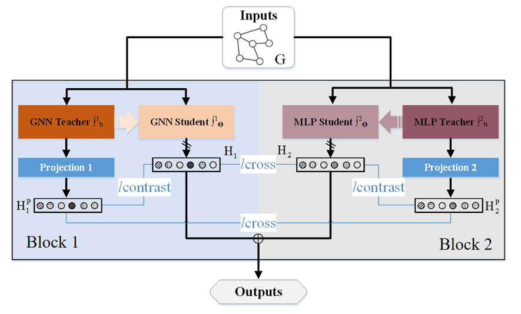

# DCGRL: Distillation with Contrastive is all you need in Graph Representation Learning

## Framework

## run diistillation methds
cd Distillation\ GNNtoMLP  you can run the poular baselines such as  LinkDist, GraphMLP, AdaGMLP, etc   

## DCGRL

cd examples\

python main.py
