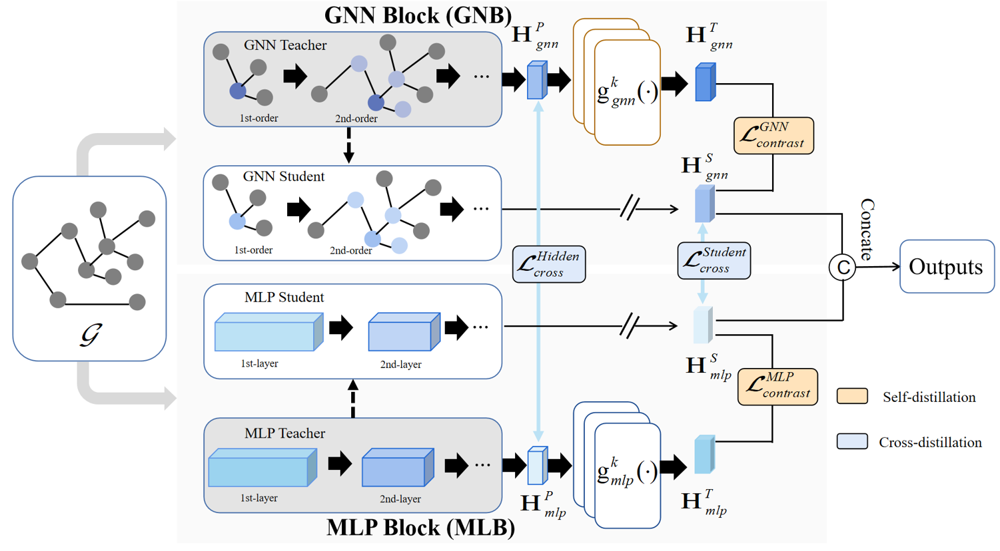

# TACo: disTillAtion with Contrastive is all you need in graph representation learning

## Framework

## run diistillation methds
cd Distillation\ GNNtoMLP  you can run the poular baselines such as  LinkDist, GraphMLP, AdaGMLP, etc   

## DCGRL

cd examples\

python main.py

## Data augmentation

Improving Contrastive Learning with Model Augmentation [\[paper\]](https://arxiv.org/abs/2203.15508) [\[code\]] (https://github.com/salesforce/SRMA)